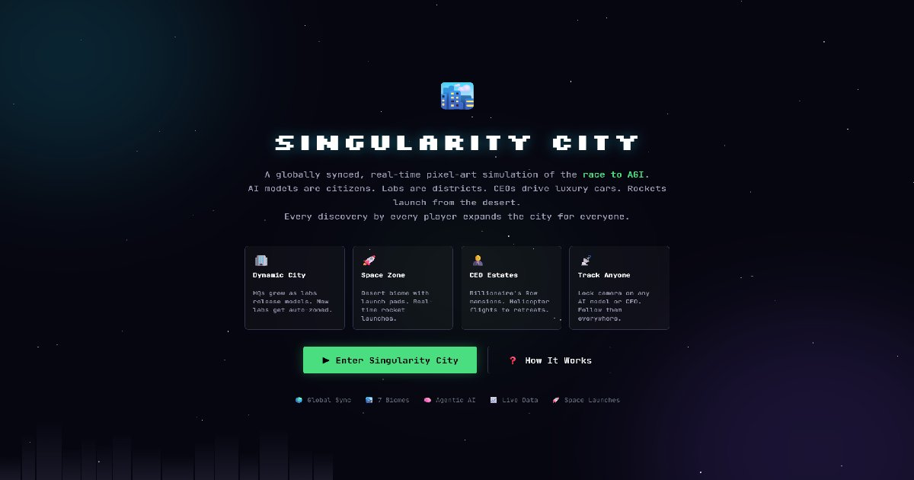

# 🏙️ Singularity City

**A real-time, globally synced pixel-art simulation of the AI industry.**

AI models are citizens. Labs are districts. CEOs drive luxury cars and fly helicopters. Rockets launch from the desert. Every discovery by every player expands the city for everyone.

🔗 **[Play Live → singularitycity.netlify.app](https://singularitycity.netlify.app)**



---

## What Is This?

Singularity City is a browser-based simulation where the entire AI industry plays out as a living, breathing pixel-art city. Over 730 AI models walk the streets as citizens, each with their own daily routines — commuting to their lab's HQ, socializing at cafés, riding the metro, and camping in the forests on weekends.

The city grows automatically through 5 data pipelines that discover new models, track real benchmarks, and sync everything to a shared cloud database. When you discover a model, it appears in every player's city.

**Built entirely through vibe coding with AI collaborators** (Claude, Gemini, Grok) — the whole thing started as "what if the AI industry was a SimCity" and snowballed from there.

---

## Features

**🏢 Dynamic City**
HQ buildings grow taller as labs release more models. New labs get auto-zoned with buildings, parking, and signage. 42+ buildings across 7 biomes.

**🚗 CEO Ecosystem**
Each lab's founder drives a luxury car between their HQ and private estate on Billionaire's Row. On weekends, CEOs take helicopters to Silicon Woods — a retreat with a whiskey bar, infinity hot tub, and putting green.

**🚇 Metro System**
Three stations (Residential, Tech District, Eastern Hub) connected by two train lines. Citizens ride the metro between zones with full enter/wait/ride/exit animations.

**🏜️ Space Zone**
A desert biome with 7 launch pads, Mission Control, Vehicle Assembly, and a Tracking Station. Rockets trigger from real Launch Library 2 API data. Sandstorm weather system independent from the city.

**🌲 Forests & Interiors**
Pine Reserve (weekend camping), Silicon Woods (CEO retreat), Frontier Pines (launch viewing area). Every building has a fully rendered interior you can enter — server rooms, cafeterias, research labs, CEO offices.

**📡 AI-Powered Scanning**
Plug in any API key (OpenAI, Anthropic, Google, xAI) and the city scans for new models using the AI itself. Flagship gap analysis tells the scanner exactly which cutting-edge models are missing.

**🌦️ Environment**
Real-time day/night cycle, seasonal weather (rain, snow, cherry blossoms), procedural audio, and a full star field with constellations.

**📊 Analytics**
ELO rankings, benchmark tracking (GPQA, MMLU, MATH, HumanEval), cost analysis, burn rate calculator, and a macro-layer "Holomap" showing the global AI compute network.

---

## Five-Source Data Pipeline

| Source | What It Discovers | Auth | Cost | Frequency |
|--------|------------------|------|------|-----------|
| 📊 **ZeroEval API** | All models, real benchmarks, pricing, context windows | None | Free | Every 20 min |
| 🤗 **Hugging Face API** | Trending open-source models with download counts | None | Free | Every 15 min |
| 🚀 **Launch Library 2** | Real rocket launch schedules and countdowns | None | Free | Every 30 min |
| ☁️ **Supabase** | Cross-player cloud sync of all discoveries | None | Free | On load |
| 🛰️ **LLM Scan** | Proprietary models, CEOs, benchmarks via AI | API key | Pay-per-use | Every 10 min |

---

## Map Layout

```
🏜️ Space Zone → 🌲 Frontier Pines → 🏠 Residential → 🌲 Pine Reserve → 🏢 Tech District → 🚇 Metro East → 🌲 Silicon Woods → 🏡 Billionaire's Row
```

---

## Tech Stack

- **Rendering:** PixiJS 7 (GPU-accelerated 2D WebGL)
- **Language:** Vanilla JavaScript (~15,000 lines, zero frameworks)
- **Backend:** Supabase (Postgres + real-time subscriptions)
- **Hosting:** Netlify (static deploy + proxy redirects for CORS)
- **Audio:** Web Audio API (procedural ambient + SFX)
- **Build:** None — no bundler, no transpiler, just files

---

## File Structure

```
├── index.html              Landing page + game shell
├── css/styles.css          All styling
├── js/
│   ├── engine.js           Game loop, init, zoning, minimap
│   ├── entities.js         Character AI, movement, metro routing
│   ├── entities_gfx.js     Character/car/train sprite creation
│   ├── environment.js      Ground, buildings, weather, sky
│   ├── camera.js           Pan, zoom, tracking, viewport compensation
│   ├── api.js              5 data pipelines, scanning, Supabase sync
│   ├── ui.js               Panels, tooltips, notifications, overlays
│   ├── data.js             Labs, stages, acts, achievements, seed models
│   ├── snd.js              Procedural audio engine
│   ├── burn_tracker.js     Cost analysis calculator
│   ├── interior_manager.js Interior routing (city/residential/space)
│   ├── interior_city_*.js  City building interiors (props, AI, core)
│   ├── interior_res_*.js   Residential interiors (props, AI, core)
│   ├── space_data.js       Launch API + space building definitions
│   ├── space_entities.js   Rocket state machines + particles
│   ├── space_environment.js Desert terrain + space building rendering
│   └── space_interior.js   Mission Control, Assembly, Tracking interiors
├── sw.js                   Service worker (offline caching)
├── manifest.json           PWA manifest
├── netlify.toml            Proxy redirects + headers
└── _headers                Security headers
```

---

## Deploy Your Own

1. Fork this repo
2. Connect it to [Netlify](https://netlify.com) (free tier works fine)
3. Netlify auto-deploys on every push — no build step needed
4. Visit your site, click ⚙️ Settings, add an API key to enable LLM scanning

The ZeroEval, HuggingFace, and Launch Library pipelines work immediately with zero configuration. Supabase cloud sync uses the shared public database.

---

## Local Development

```bash
# Any static server works
npx serve .
# or
python -m http.server 8000
```

Note: HuggingFace API works locally (has CORS headers). ZeroEval requires the Netlify proxy, so it only works when deployed.

---

## How It Was Built

This entire project was built through **vibe coding** — collaborative development with AI models:

- **Claude** (Anthropic) — Deep codebase audits, architecture decisions, performance optimization, multi-file refactors
- **Gemini** (Google) — Feature implementation, UI polish, interior generation
- **Grok** (xAI) — Model discovery scanning, creative feature ideas

Zero lines of code were written by hand. Every line was generated, reviewed, and iterated through conversation with AI collaborators.

---

## License

MIT — do whatever you want with it.
